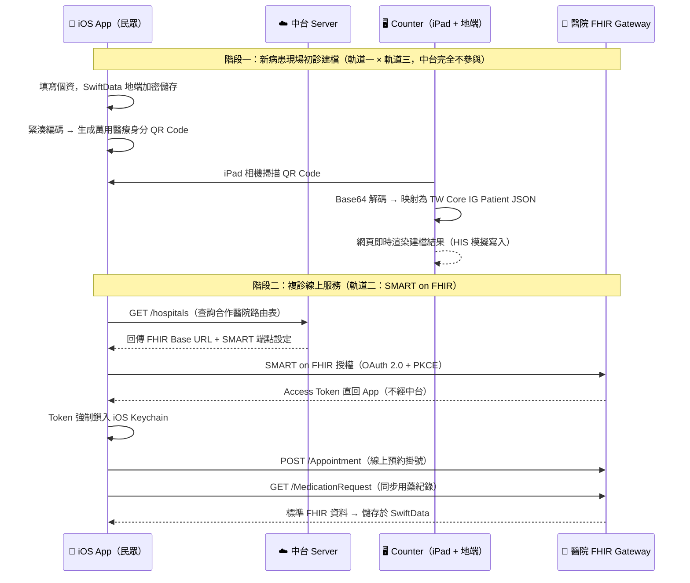

# 萬用醫療身分 App 系統架構設計書 (iOS & SMART on FHIR MVP)

本系統採用**「現場離線建檔 + 遠端線上服務」**的漸進式雙軌創新架構。前端 iOS App 專注於跨院通行的流暢用戶體驗，中台 Server 作為去識別化的信任中繼站，並搭配輕量化地端 Web 掃碼模組與標準雲端沙盒環境以完整閉環體驗。

本 MVP 的核心旨在解決第三方醫療服務導入時最大的兩大痛點：**醫院極高的資安防火牆阻力**，以及**《個人資料保護法》的嚴格合規限制**。

---

## 🛠️ 三軌運作與漸進式用戶旅程 (User Journey)

本系統將技術與資安高牆完全解構，依據用戶就診狀態（新病人 vs 複診病人）以及現場實務櫃檯，拆分為三個獨立運作、相輔相成的模組：

### 軌道一：新就診現場建檔與報到（完全離線 / 零資安阻力）
* **情境**：用戶首次至該合作醫院/診所就診，醫院系統內尚無該用戶之病歷號（`Patient.id`）。
* **iOS App 端（極簡高容錯編碼）**：
    * 用戶於地端輸入基本個資（姓名、身分證字號、生日、電話）。App 使用內建的 SwiftData 進行本地加密儲存。
    * **效能與容錯優化**：為確保醫院現場老舊掃描槍或低解析度自助機在 0.1 秒內順利讀取，App **不直接** 將肥大的標準 FHIR JSON 轉為 QR Code。而是採用自訂緊湊字串格式（`身分證|姓名|生日(YYYYMMDD)|性別(M/F)|電話`），目標經由 Gzip + Base64 編碼將資料量壓縮至 100 Bytes 以內，於螢幕產出大顆粒、高對比度的**萬用醫療身分 QR Code**。
* **中台 Server 端**：**完全不參與、不經手、不留存任何個資。**
* **MVP 核心優勢**：**推廣零阻力。** 醫院不需為「個資寫入」開放任何對外 API 或調整任何外部防火牆規則，100% 規避資安室對外部系統寫入個資的法規與資安審查。

### 軌道二：複診線上預約與加值服務（標準安全線上通道）
* **情境**：用戶已透過軌道一在該院完成初診建檔，或本身即為該院之既有複診老病人。
* **iOS App 端（標準安全授權）**：
    * 用戶點選該合作醫院，App 向中台 Server 查詢該院的路由表與 SMART 設定，並利用 iOS `ASWebAuthenticationSession` 啟動標準的 **SMART on FHIR 授權流程 (OAuth 2.0 + PKCE)**。用戶在彈出的醫院官方網頁完成身份登入與授權驗證。
    * **Keychain 資安防護**：驗證成功後，App 取得之 Access Token 與 Refresh Token **嚴禁** 儲存於 `UserDefaults` 或一般檔案中。系統將憑證強制鎖入 **iOS Keychain（安全鑰匙圈）**，並啟用 `kSecAttrAccessibleAfterFirstUnlockThisDeviceOnly` 加密宣告，確保手機在鎖定或備份時憑證絕不外洩。
* **線上互動解鎖**：
    * **線上預約掛號（寫入）**：解鎖成功後，App 取得 Access Token。用戶可在地端一鍵選擇科別與診別，由 App 直連醫院的 FHIR Gateway 發送 `POST /Appointment`，實現**在家遠端預約掛號**。
    * **病歷健康同步（讀取）**：看診結束後，App 可安全地透過 TLS 通道向醫院發送 `GET /MedicationRequest` 或 `GET /Observation`，將個人的用藥紀錄與檢驗報告同步回手機地端，建立個人健康生態系。

### 軌道三：醫院櫃檯端掃碼模擬系統 (FHIRpass-Counter MVP)
* **情境**：實機展示（Live Demo）或既有診所快速無痛導入方案。醫院無須動用龐大 IT 預算修改 HIS 核心，僅需在櫃檯配置一台連線至區網的 iPad/平板即可立即上線。
* **醫院端 Web 前端 (iPad 瀏覽器)**：
    * 櫃檯人員開啟專屬 Web App，網頁將自動要求調用 iPad 的後置相機鏡頭作為「虛擬條碼掃描槍」。
    * 透過整合開源 JavaScript 掃碼庫（`html5-qrcode`），能對民眾出示的動態 QR Code 進行即時捕捉與高速解析，並將讀取到的緊湊編碼透過區網發送至地端 API。
* **地端接收後端 (解碼與 HIS 模擬模組)**：
    * 運行於醫院內部區網伺服器（Demo 時可於 Mac/PC 本地端運行 FastAPI）。
    * 負責接收緊湊字串，執行 Base64 解碼與 zlib 解壓縮，並將原生個資自動映射（Mapping）組裝成標準的 **TW Core IG Patient JSON**。
    * **HIS 模擬展示**：網頁右側會立刻亮起成功綠燈，以高科技感的可視化表格（Table）與標準 FHIR 樹狀結構呈現該病患資料，模擬點擊「確認寫入」即可一秒完成初診建檔。

---

## 📊 系統三層架構與資料流 (Data Flow)



---

## 🗄️ 數據庫與資料結構設計

### 1. iOS 地端/掃碼還原格式（符合臺灣核心實作指引 TW Core IG）
當醫院櫃檯端（iPad/地端後端）讀取 QR Code 的緊湊字串後，會將其還原並映射為標準的 `Patient` 資源 JSON 結構如下，用以直接匯入醫院系統：

規格：[TW Core IG Patient Profile](https://twcore.mohw.gov.tw/ig/twcore/StructureDefinition/Patient-twcore)

```json
{
  "resourceType": "Patient",
  "id": "example-patient",
  "meta": {
    "profile": [
      "https://twcore.mohw.gov.tw/ig/twcore/StructureDefinition/Patient-twcore"
    ]
  },
  "identifier": [
    {
      "use": "official",
      "type": {
        "coding": [
          {
            "system": "http://terminology.hl7.org/CodeSystem/v2-0203",
            "code": "NNTWN",
            "display": "National Person Identifier"
          }
        ]
      },
      "system": "http://moi.gov.tw",
      "value": "A123456789"
    }
  ],
  "name": [
    {
      "use": "official",
      "text": "陳小明"
    }
  ],
  "gender": "male",
  "birthDate": "1981-05-30",
  "telecom": [
    {
      "system": "phone",
      "value": "0912345678",
      "use": "mobile"
    }
  ]
}
```

### 2. 中台 Server 數據庫設計（去識別化無狀態路由表）
中台 Server **完全不儲存**任何病人的敏感醫療隱私、個資與 OAuth 憑證，僅需維護一張符合 SMART on FHIR 規範的合作醫院動態連線黃頁簿（Hospital Routing Table），支援動態發現（Discovery）與靜態配置雙軌制：

```sql
CREATE TABLE hospital_routing (
    fhir_id             VARCHAR(50)  PRIMARY KEY,  -- 醫院識別碼（例如 NTUH、VGH、LOGICA_TEST）
    hospital_name       VARCHAR(100) NOT NULL,      -- 醫院名稱
    fhir_base_url       VARCHAR(255) NOT NULL,      -- 醫院的 FHIR API 進入點（EHR Gateway）

    -- SMART on FHIR 認證端點配置
    smart_well_known_url VARCHAR(255),              -- /.well-known/smart-configuration（動態發現）
    auth_authorize_url   VARCHAR(255),              -- OAuth2 認證網址（靜態備用）
    auth_token_url       VARCHAR(255),              -- OAuth2 Token 網址（靜態備用）

    is_active           BOOLEAN      DEFAULT TRUE,
    updated_at          TIMESTAMP    DEFAULT CURRENT_TIMESTAMP
);
```

---

## 🧪 研發與測試環境規範 (MVP Sandbox Specification)

為確保開發效率與系統合規驗證，本 MVP 採取「本地封閉」與「國際雲端沙盒」雙軌測試環境配置：

### 1. 軌道一與軌道三（離線建檔閉環）測試配置
* **測試範疇**：自訂緊湊字串編碼、QR Code 實體讀取率、地端解碼與 TW Core IG 欄位映射機制。
* **環境設定**：**完全不使用外部網路伺服器**。
    * **民眾端**：iOS App 運行於實機（iPhone），生成動態 QR Code。
    * **櫃檯端**：iPad 連接與開發筆電（Mac/PC）相同的本地 Wi-Fi 區網，開啟 Web 掃碼網頁。
    * **解碼端**：開發筆電本地運行 FastAPI 服務，接收 iPad 區網 POST 請求並進行還原，完全模擬醫院防火牆內的獨立運作流。

### 2. 軌道二（SMART on FHIR 線上授權）測試配置

本 MVP 採**雙層測試策略**：

#### 2a. 快速授權流程驗證（公用沙盒）
* **測試範疇**：OAuth2 + PKCE 流程、ASWebAuthenticationSession 喚起、Token 換發與 Keychain 鎖入。
* **環境設定**：[SMART Health IT](https://launch.smarthealthit.org) 公用沙盒（免註冊，含現成合成 Patient）。
* **測試流程**：`make server` 啟動中台 → iOS App 點選「SMART Health IT 測試沙盒」→ 點「連結此醫院帳號」→ Safari 跳出授權頁並選取測試 Patient → Token 自動鎖入 Keychain → 顯示「已完成授權」。
* **限制**：沙盒合成病人與 iOS App 本地建立的病人資料無關，僅能驗證授權流程，**無法測試雙軌串接**。

#### 2b. 雙軌端對端整合測試（本地 Docker 沙盒）
* **測試範疇**：完整驗證「QR 建檔（軌道一）→ OAuth2 存取同一份病歷（軌道二）」全程閉環。
* **環境設定**：本地 SMART Dev Sandbox（SMART Health IT 官方 Docker image，HAPI FHIR + OAuth2 Launcher 一體）。
* **完整流程**：

```
軌道一：Counter 掃 QR → 解碼病人資料 → POST Patient 到本地沙盒 → 取得 FHIR Patient ID
軌道二：iOS App OAuth2 → Launcher 列出沙盒 Patient（含剛建的）→ 選取 → token.patient = 該 ID
        → iOS App 呼叫 FHIR API → 讀取同一筆病歷
```

* **狀態**：規劃中（`make sandbox`，待實作）。

---

## 🎯 MVP 商業與合規優勢總結

1. **極致的法規避險（Compliance）**：
   中台 Server 採取「無狀態（Stateless）」架構，完全不經手、不留存任何醫療隱私與個資，所有敏感憑證均鎖在 iOS 硬件級的 Keychain 中。這讓產品在《個人資料保護法》與衛福部資安稽核面前立於不敗之地，合規成本與法律責任趨近於零。

2. **切入市場的特洛伊木馬（Go-To-Market）與極速 Live Demo**：
   大醫院的防火牆阻力極高。本 MVP 巧妙地利用「軌道一（離線建檔）」結合「軌道三（iPad 虛擬櫃檯）」作為破冰船。商務談判現場無須串接醫院系統，只需用兩台行動裝置即可完美演示「0.1 秒掃碼、地端立即生成醫學中心級標準 FHIR 格式」的閉環流程。證明在「完全不用改對外防火牆、不開放寫入 API」的前提下即可為醫院帶來排隊減流成效。

3. **萬用插座的平台規模化（Scalability）與對接國際實力**：
   由於前端、中台、醫院模擬端與外部測試環境完全基於國際標準 SMART on FHIR 與台灣 TW Core IG 規範，App 不需要為個別醫院進行客製化開發（Hardcoding）。不論是測試階段的 SMART Health IT 公用沙盒，還是未來真實導入推動 FHIR 的醫學中心，中台只需更新一列資料庫路由配置，App 即可瞬間動態解鎖，具備極高的平台擴張性。
